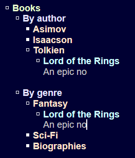

## Intro

Hierarchies are a convenient way to organize information.
However, things don't always fit neatly into one hierarchy.
Sometimes they belong to several hierarchies at the same time.

[An outliner](https://en.wikipedia.org/wiki/Outliner) is a tool for manipulating text structured like a tree.
This program works with directed graphs instead of trees.

## Features/Contols

### Regular text editing

* Arrow keys
* Shift-Arrows
* Home, End
* PgUp, PgDown
* Backspace, Del
* Ctrl-C, Ctrl-V, Ctrl-X
* Ctrl-Z for undo, Ctrl-Y for redo
* Alt-Up, Alt-Down to move lines
* Ctrl-P to toggle monospace font

### Hierarchy

* Type "* " to create a node
* Tab to expand/collapse nodes
* Alt-Enter to create a node after the current node
* Alt-Left, Alt-Right to move stuff between levels

### Not a tree

A node can have multiple parents.
To add another parent, copy and paste the node inside the new parent.

All occurrences of the same node share the content, but can have different headers.

* Ctrl-Tab, Ctrl-Shift-Tab to cycle through occurrences of the node
